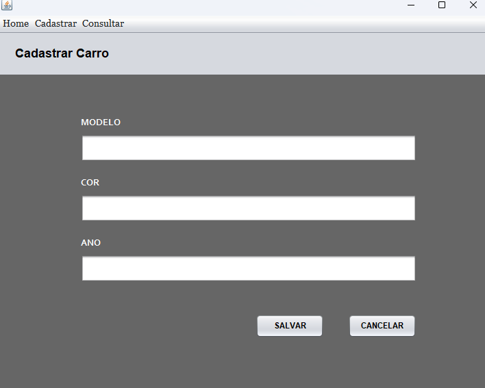
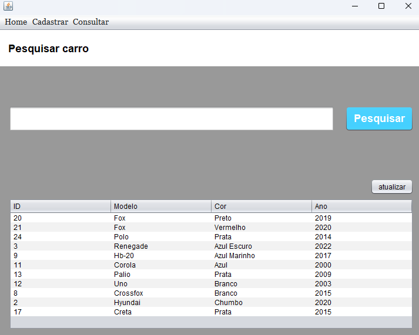
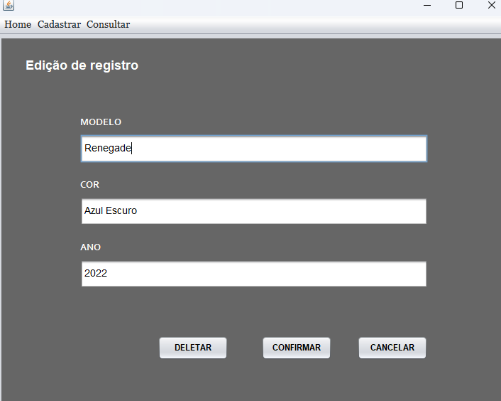

# java-swing
Este projeto foi desenvolvido utilizando Java + swing seguindo conceitos de **Arquitetura Limpa** (Clean Architecture) e
princípios **SOLID**. O objetivo principal era aplicar e aprimorar conceitos de arquitetura de software e programação orientada
a objetos. O sistema foi projetado objetivando a separação de componentes em **camadas** de forma a estabelecer uma
**hierarquia de níveis**. Nesse sistema, a flecha de dependência entre componentes deve apontar do componenete de menor nível
para o componente de maior nível e nunca vice-versa. O gerenciador de dependências utilizado foi o maven.

    Versão java: 21.0.4
    Build System: maven
---
## Postgresql
O sistema conta com operações CRUD por meio do banco de dados Postgresql. Os scripts de criação do banco e suas tabelas se
encontram temporariamente no arquivo `bd.sql` presente no componente `Database`.

## Interface
Intefarce gráfica desenvolvida utilizando Swing foi organizada em um JFrame principal juntamente a quatro JPanels. Há panel para
cadastro, consulta e edição/deleção.

### Tela de Cadastro

### Tela de Consulta

### Tela de edição

---